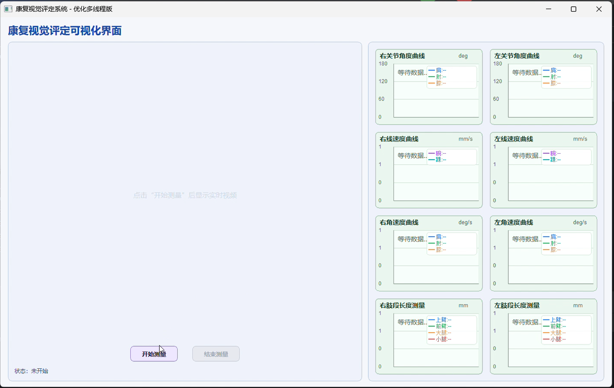
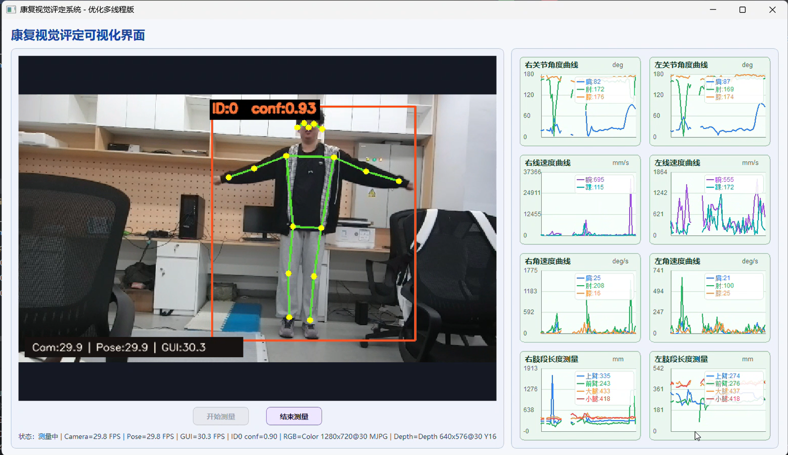

# yolo_motion_detect
基于 **YOLOv8-Pose + Orbbec 深度相机 + PyQt** 的康复动作视觉评定项目。该项目围绕人体姿态检测、深度对齐、关节角度计算、线速度/角速度估计、肢段长度测量以及实时可视化界面展开，适合作为课程实验、科研训练或康复评估原型系统使用。
## 项目简介
本项目使用 Orbbec 深度相机同步采集彩色图像与深度图，结合 YOLOv8-Pose 进行人体关键点检测，并进一步完成：
- 关节角度计算（肩、肘、膝等）
- 关键点线速度计算（腕、踝等）
- 关节角速度计算
- 上臂、前臂、大腿、小腿等肢段 3D 长度测量
- 基于 PyQt 的实时可视化界面展示
项目后期版本引入了 **相机采集线程 / 姿态推理线程 / GUI 刷新线程解耦** 的多线程优化方案，可在保证实时性的同时减少推理延迟累积。
## 项目展示

### 主界面示意



### 测量效果示意



## 主要功能
### 1. 深度相机接入与标定参数获取
- 连接 Orbbec 相机
- 获取彩色流与深度流
- 开启深度到彩色图像的硬件对齐（D2C）
- 读取相机内参、畸变参数等信息
### 2. 人体姿态检测
- 基于 `ultralytics` 的 YOLOv8-Pose 模型
- 检测 COCO 17 个关键点
- 支持实时视频流中的单人姿态估计
### 3. 运动学参数计算
- **关节角度**：肩关节、肘关节、膝关节等
- **线速度**：腕部、踝部等关键点速度
- **角速度**：关节角度对时间的变化率
- **肢段长度**：上臂、前臂、大腿、小腿的 3D 长度
### 4. 可视化界面
- 左侧实时视频显示
- 右侧多张曲线卡片展示不同指标
- 底部“开始测量 / 结束测量”交互控制
- 状态栏显示系统运行状态
### 5. 多线程优化
在后续版本中，项目进一步实现：
- 相机采集线程持续获取最新 RGB + Depth 帧
- YOLO 推理线程只处理最新帧，旧帧直接丢弃
- GUI 使用定时器异步刷新视频、曲线与状态
- 显著降低延迟累积，提高界面流畅度
## 仓库内容说明
当前仓库中包含多个阶段性脚本，反映了项目从基础验证到完整 GUI 系统的迭代过程：
- `4.2.py`：基于普通视频流与 YOLO 的基础角度/速度计算示例
- `5.3.py`：Orbbec 相机彩色流、深度流与 D2C 对齐测试
- `5.4.py`：Orbbec + YOLOv8 Pose 的联合测试
- `7.2.1.py`：打印相机内参与畸变参数
- `7.3.py`：深度相机 + 姿态关键点 + 三维信息可视化
- `8.py`：加入更完整的姿态分析逻辑
- `9.py`：PyQt 多线程版 GUI，支持角度、速度、长度实时显示
- `10.py`：优化后的多线程 GUI 版本，推荐作为当前主版本使用
## 推荐运行版本
如果你只是想直接体验完整系统，建议优先运行：
```bash
python 10.py
```
该版本集成了：
- PyQt 图形界面
- Orbbec 相机采集
- YOLOv8-Pose 姿态估计
- 实时角度 / 速度 / 长度曲线显示
- 更稳定的多线程架构
## 环境依赖
建议使用 Python 3.9 及以上版本。
### 基础依赖
```bash
pip install PyQt5 ultralytics opencv-python numpy
```
### 额外依赖
本项目还依赖 Orbbec 官方 Python SDK：
- `pyorbbecsdk`
请根据相机型号与系统环境，提前完成 SDK 安装与配置。
## 运行方法
### 1. 克隆仓库
```bash
git clone https://github.com/ZhiMayou0516/yolo_motion_detect.git
cd yolo_motion_detect
```
### 2. 安装依赖
```bash
pip install PyQt5 ultralytics opencv-python numpy
```
并确保已经正确安装 `pyorbbecsdk`。
### 3. 下载或准备 YOLOv8 Pose 权重
默认脚本中通常直接调用：
```python
YOLO("yolov8n-pose.pt")
```
首次运行时若本地没有该权重，`ultralytics` 一般会自动下载。
### 4. 连接 Orbbec 深度相机
确保设备已正确连接，并能被 SDK 正常识别。
### 5. 运行主程序
```bash
python 10.py
```
## 界面说明
以 `10.py` 为例，界面主要由以下部分组成：
- **左侧主视频区**：显示实时彩色画面与姿态叠加结果
- **右侧曲线卡片区**：
  - 右关节角度曲线
  - 左关节角度曲线
  - 右线速度曲线
  - 左线速度曲线
  - 右角速度曲线
  - 左角速度曲线
  - 右肢段长度测量
  - 左肢段长度测量
- **底部控制按钮**：开始测量、结束测量
- **状态栏**：显示当前系统状态
## 技术路线
项目整体流程可以概括为：
1. Orbbec 相机采集彩色图像与深度图
2. 深度图与彩色图做硬件对齐
3. 使用 YOLOv8-Pose 提取人体关键点
4. 结合深度信息恢复关键点三维坐标
5. 计算角度、线速度、角速度、肢段长度等指标
6. 将结果实时绘制到 PyQt GUI 中
